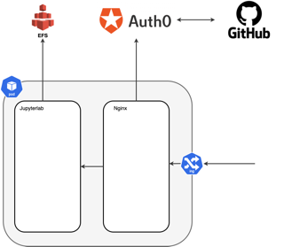

# Nginx/Auth0 Proxy

A simple Dockerized authentication proxy for Jupyterlab.

Jupyterlab is deployed by the Control Panel. When deployed the pod looks like the image below, with Jupyterlab protected from the internet by this proxy.

The authentication is done using an OIDC call to Auth0, the call is written in lua.

N.B. There may in future be a better solution, however at time of implementation, lua was the nginx community recommended solution for this authentication flow.
## Usage locally

All interactions are performed via the `Makefile`.

| Makefile command | Description |
| ---------------- | ----------- |
| clean | stop & destroy containers |
| pull | pull the latest image (unused) |
| push | push the image to a docker repository (gha-only) |
| build | build the proxy image |
| up | start the proxy and jupyter in daemon mode |
| logs | see the logs |
| integration | just run the tests (for gha) |
| test | run the test process including start and cleanup |

### Running the Application Locally

Ensure you have the expected environment variables (see below) in a `.envrc`
file. Then run `direnv allow` to set these for work done in the project's home
directory.

Run `make build` then `make up` to start the proxy and Jupyter. Once up, you'll
find it at http://_<your_github_username>_-jupyter-lab.127-0-0-1.nip.io:8001/.

On the callback from Auth0, you'll need to remove the s from the https in the callback url, 
because this doesn't have http support.
(https is handled by kubernetes ingress in production.)

To view logs, `make logs`.

To stop the proxy, `make clean`.

To restart and rebuild, `make clean build up`.

## Environment Variables

| Environment Variable | Description                                          |
| -------------------- | -----------------------------------------------------|
| APP_HOST             | The hostname of the proxied app (e.g. rstudio)       |
| APP_PORT             | Port on which the proxied app is listening (eg 8787) |
| USERNAME             | GitHub username of the person whose instance this is |
| LOGOUT_URL           | To where users should be directed on logout          |
| AUTH0_TENANT_DOMAIN  | From Auth0, the context in which users authenticate  |
| AUTH0_CLIENT_ID      | From Auth0, identifies the app in the tenant         |
| AUTH0_CLIENT_SECRET  | From Auth0, for the referenced app in the tenant     |
| REDIRECT_DOMAIN      | The root domain name that AP tools are running on    |

## Releasing

The `Prep Tags` step in the GitHub workflow changes the pushed tag based on the
GitHub trigger.

- If tags have been pushed, use that tag as the version
- If the default branch is pushed to, tag the image as edge
- If a PR is pushed, tag as per the PR number
- Anything other than the above scenarios: use the Git SHA

## In production usage

The nginx-proxy-jupyter container is deployed via helm chart without using the Makefile or docker-compose.

It will need the above environment variables to be set; the startup script will complain if they are not.

Currently it's used in the following charts
- jupyter-lab
- jupyter-lab-all-spark
- jupyter-lab-datascience-notebook

## For future developers reference

This is the current nginx proxy for Jupyter lab as of 5th April 2022.
